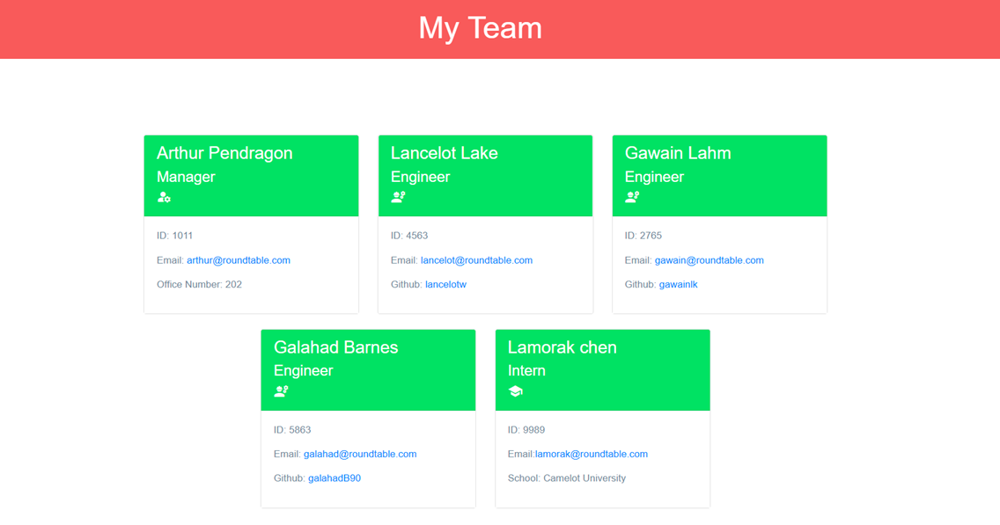

# Team Profile Generator

## A simple tool to generate a professional ReadMe Markdown file


<a href="https://img.shields.io/badge/JavaScipt-100%25-yellow"></a> <a href="https://img.shields.io/badge/Used-Node.js-red"></a> <a href="https://img.shields.io/badge/npm-Inquirer-orange"></a>

## Table of Contents

- [Description](#description)
- [Installation](#installation)
- [Usage](#usage)
- [Contribution](#contribution)
- [Test Instructions](#test-instructions)
- [License](#license)
- [Contact Information](#contact-information)

## Description

Team profile generator is easy way to generate details of a team working on a project. This light app generates an webpage with the details on team's position and role in a team. It also provide details of individual team members in the group.

## Installation  

#### To run this program, user must install Node.js first  
#### User also need the following dependencies

    * Inquirer
    * Chalk
    * Jest

- open terminal
- clone the repo: `https://github.com/thossain89/Team_Profile_Generator.git`
- cd into new directory (Must be in directory to work) 
- Download Inquirer package by entering `npm install inquirer`
- Download Chalk package by entering `npm install chalk`
- Download Jest package by entering `npm install jest`
- enter `node index`
- follow the prompt

## Usage

Answer the prompt questions:_Press enter to move to the next question._

```
Who is the manager of this team ?
Please enter Manager's ID
Please enter manager's email address
Please enter manager's office number
Please choose your employee's role (Engineer/Intern).
What's the name of the employee?
Please enter the employee's ID
Please enter employee's email address
Please enter the employee's github username (For Engineers only).
Please enter the intern's school name

Would you like to add more team members?
```

Once you have answered all the questions a HTML page will be generated for you!
It will be named `Index.html` inside dist folder.

## Sample Team Profile Page :

  

#### You can find full video of how to use it [here](https://drive.google.com/file/d/11iV5xSzVvQISwsN-iCAYGQBo6sZ2jJ05/view).

#### You can find sample Index.html file [here](./dist/index.html)

## Contribution

If you would like to contribute to this project reach out to me. Contact Information can be found below or by clicking on the 'Contact-Information' link provided in the Table of Contents.

## Test Instructions
#### For testing user must install Jest dependency in Node.js module

run: `npm run test` in console


#### You can find full video of how to conduct test [here](https://drive.google.com/file/d/1vTXTDQamgT_O4w4xpmhmMh5k5EXmAV0m/view).

## License

<a href="https://img.shields.io/badge/License-MIT-brightgreen"></a>

## Contact Information

[Email Address](tanvirhossain2006@gmail.com)

[Github Repo ReadMe Generator](https://github.com/thossain89/Team_Profile_Generator.git)

## Authors   

  


* **Tanvir hossain** [Git Hub Profile](https://github.com/thossain89)  

&copy; 2021 Tanvir Hossain, Coding Bootcamp ,University of Sydney and Trilogy Education
